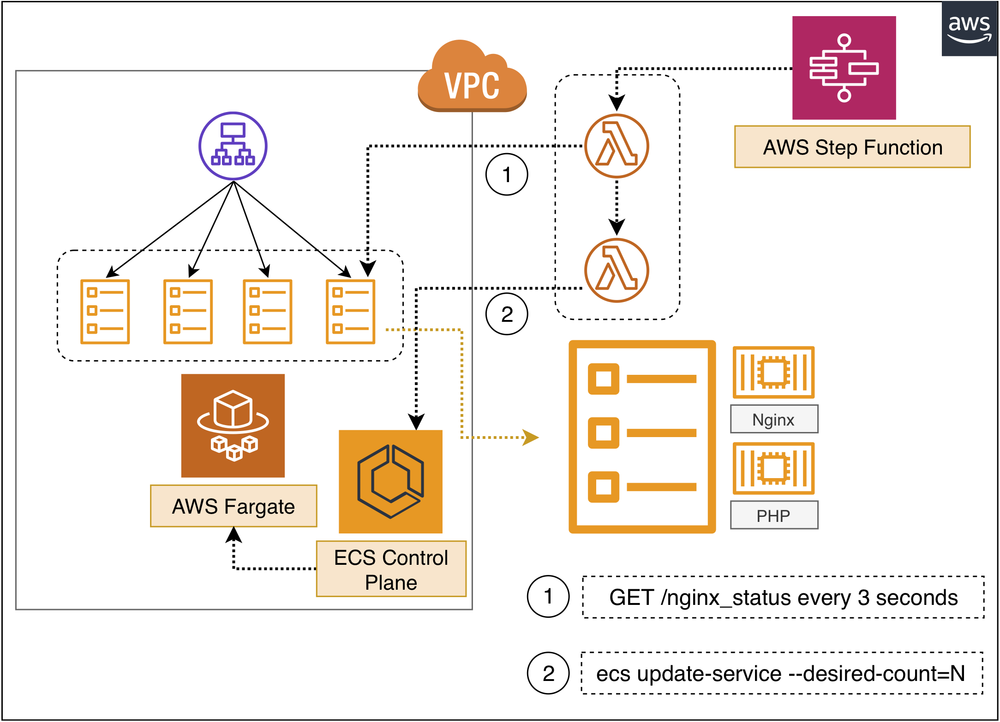
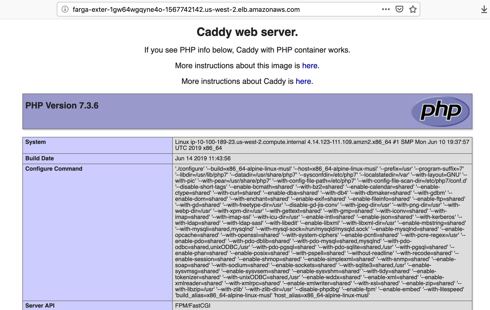
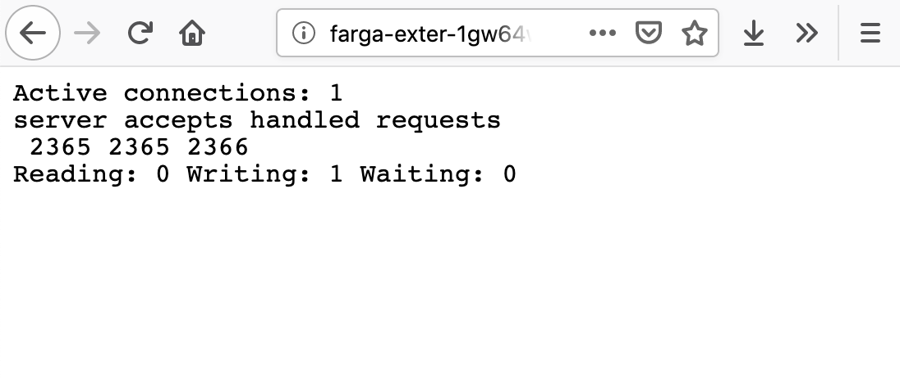
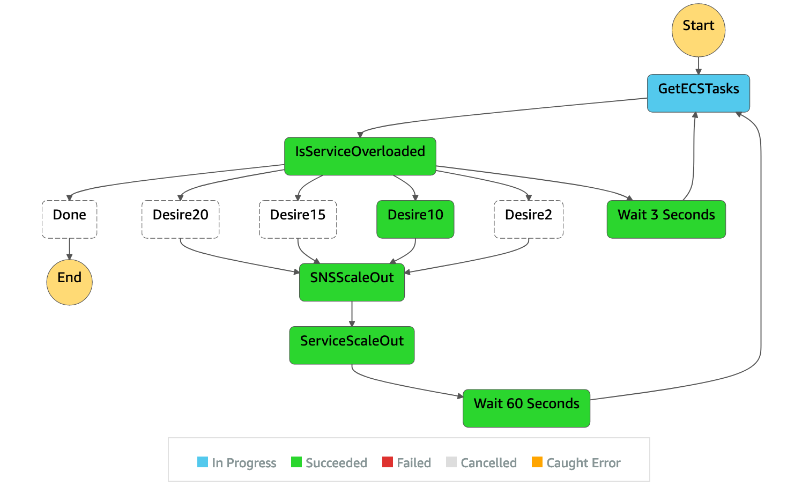

[](https://badge.fury.io/js/cdk-fargate-fastautoscaler)
[](https://badge.fury.io/py/cdk-fargate-fastautoscaler)


## aws-fargate-fast-autoscaler

**AWS Fargate Fast Autosaler** - A Serverless Implementation that Triggers your AWS Fargate autoscaling in seconds with `cdk-fargate-fastautoscaler`.

## cdk-fargate-fastautoscaler

`cdk-fargate-fastautoscaler` is a [aws/jsii](https://github.com/aws/jsii) construct library for AWS CDK.

By building your AWS CDK stacks with `cdk-fargate-fastautoscaler`, you can create your customized Fargate workload with the fast autoscaling capabilities.




# How it works

Behind the scene, our workload in PHP, NodeJS, Java or Python is running with a nginx reverse proxy within a single AWS Fargate Task exposing a `/nginx_status` endpoint for realtime connections info generation. All traffic coming through ALB to Fargate tasks will establish active connecitons with the nginx reverse proxy before it can hit our backend server. 

We are running an AWS Step Function state machine to periodically invoke the AWS Lambda function and collect active connection numbers from each Fargate Task **every 3 seconds** and determine our scaling policy in the state machine followed by immediate `ecs service update` to increase the desired number of Fargate tasks.

# AWS CDK Sample

The following CDK sample creates a PHP service in AWS Fargate with the nginx as the reverse proxy.

```ts
import * as cdk from '@aws-cdk/core'
import * as ec2 from '@aws-cdk/aws-ec2';
import { AwsLogDriver, ContainerImage } from '@aws-cdk/aws-ecs';
import { FargateFastAutoscaler } from 'cdk-fargate-fastautoscaler';
import * as path from 'path';

const app = new cdk.App()

const env = {
  region: process.env.CDK_DEFAULT_REGION,
  account: process.env.CDK_DEFAULT_ACCOUNT,
};

const stack = new cdk.Stack(app, 'FargateFastAutoscalerDemo', { env })

const vpc = ec2.Vpc.fromLookup(stack, 'Vpc', { isDefault: true })

new FargateFastAutoscaler(stack, 'FargateFastAutoscaler', {
  vpc,
  // create the backend PHP service
  backendContainer: {
    image: ContainerImage.fromAsset(path.join(__dirname, '../../sample/backend/php')),
  },
  // PHP service running on container port 2015
  backendContainerPortMapping: [
    { containerPort: 2015 },
  ],
})
```

On deployment complete, you'll see the URL in the Outputs:

**fargate-fast-autoscaling.URL** = http://farga-exter-1GW64WGQYNE4O-1567742142.us-west-2.elb.amazonaws.com

Open this URL and you will see the Caddy web server welcome page with phpinfo.




And if you append `/nginx_status` in the URL and reload the page, you'll see this page:



### Start your state machine

Go to Step Function console and click **start execution** on the state machines. Leave the execution name and input column as is and click **start execution** again. Your state machine will be running. Behind the scene the step function will invoke a Lambda function to collect **Active Connections** number from nginx reverse proxy on each fargate task and determine a new desired number of fargate tasks to scale. Typically it would just take **less than 10 seconds** before it starts to scale.



# SNS Service Integration

The **SNSScaleOut** task in the state machine leverages direct Amazon SNS service integration to publish a notification to your SNS topic. You will receive SNS notification when it starts **ServiceScaleOut** task.

Specify the `snsTopic` property to define your custom SNS topic. If not defined, the construct will create a default SNS topic.


# Disable Scale In

By default, `disableScaleIn` is set to true to prevent your workload from scale-in. If you prefer to enable scale in, set `disableScaleIn` to `false`.


## License Summary

This sample code is made available under the MIT-0 license. See the LICENSE file.
